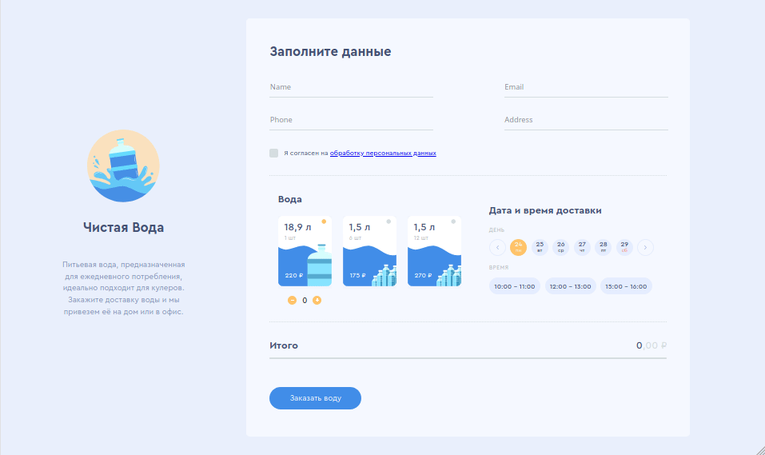
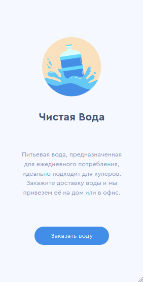

## React SPA demo

This is a water company website adapted for mobile and desktop
devices. Also it adapts well to various screen resolutions.

## Screenshot

### desktop

### mobile

[Click to see online demo](https://gogn.github.io/anmedio-water-site/)

## How it works

### Used technologies:

`react-dom` `react-router-dom`
page routing

`moment.js`
date management

`is.js`
RegExp management

The project doesn't use Redux. Instead, it uses flux-like state management with Hooks.
Hooks are built-in React feature that let manipulate the state without additional libraries.

Store defined in /src/store/

### Mobile and desktop

Different mobile and desktop layouts uses the same components, but compose
and use them in a different way.
Screen resolution for mobile devices defined as 
screen width < 600 and screen height < 800. If these conditions are defined,
page will be loaded with mobile orientation.

Structure of components is defined in /src/Pages/

### Styling

Flexbox is uses to adaptive layouts.

CSS define in a functional-like style. The main file is the index.css.
Components uses their own css in addition.

All graphic is a SVG or react components with SVG which styles through props.

